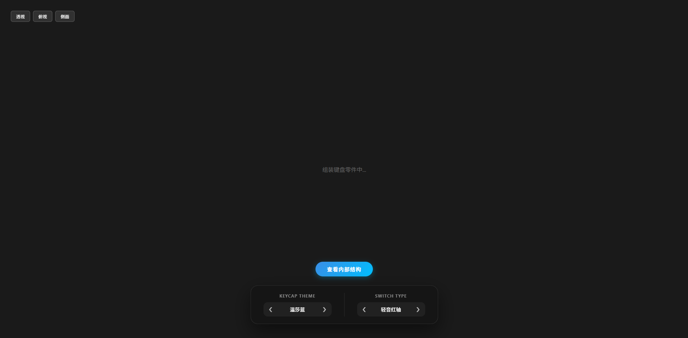
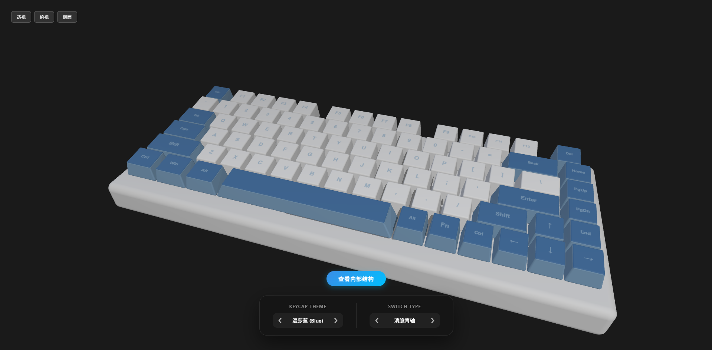
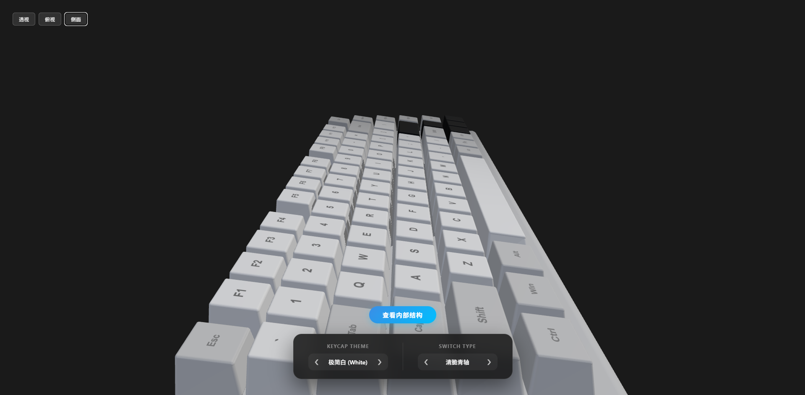

# 键识库

### 品牌定位

键识库——首个专注于键盘产品体验服务的专业平台，致力于构建"认知-体验-决策"的完整消费闭环，成为键盘产品体验领域的专业引领与行业标准制定员。我们精准定位为“专业体验服务提供商”，而非简单的销售平台。键识库通过专业线下体验空间与智能线上科普系统的双轮驱动，为用户提供从了解、对比到决策的完整路径。我们的线下体验空间不仅包含轴体体验区和成品键盘体验区，还特别设置了DIY区，让用户能够亲身参与键盘的个性化定制过程，激发创造力与参与感。

### 核心价值提炼

"触感真实，体验无忧"——通过专业的线下体验空间与精准的线上科普系统，让消费者真正"触摸"到键盘的质感与声音，消除选购决策的不确定性，实现"所见即所得"的体验升级。

### 产品与解决方案

键识库构建了“线下专业体验空间 + 线上智慧决策系统”的集成化解决方案。该体系旨在通过物理空间的触觉还原与数字端的知识赋能，彻底消除消费者在键盘选购过程中的感官信息不对称，提供从认知、体验到深度定制的统一的全链路服务。

### 仓库

本仓库为键识库的**3D键盘模型爆炸效果**演示网站的代码仓库，[**仅做课程演示**](https://liangruogu.github.io/Key-Warehouse/index.html)

